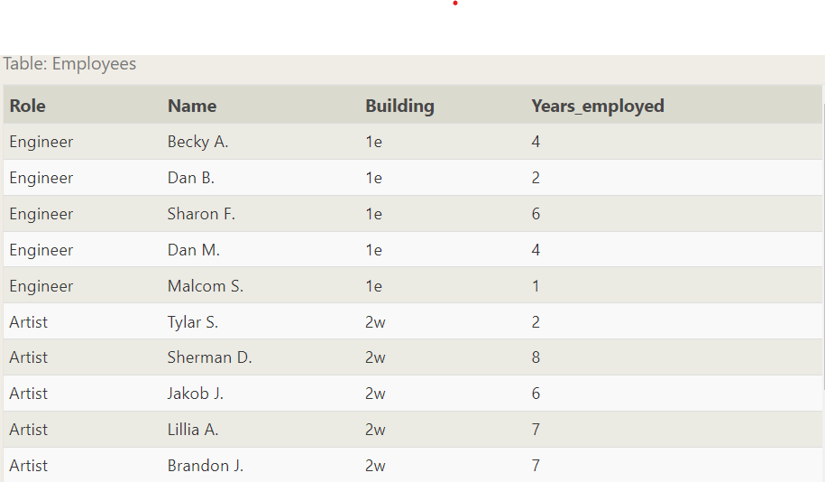

SQL exercise [Link](https://sqlbolt.com/lesson/select_queries_introduction)
# SQL Lesson 8: A short note on NULLs
As promised in the last lesson, we are going to quickly talk about NULL values in an SQL database. It's always good to reduce the possibility of NULL values in databases because they require special attention when constructing queries, constraints (certain functions behave differently with null values) and when processing the results.

An alternative to NULL values in your database is to have data-type appropriate default values, like 0 for numerical data, empty strings for text data, etc. But if your database needs to store incomplete data, then NULL values can be appropriate if the default values will skew later analysis (for example, when taking averages of numerical data).

Sometimes, it's also not possible to avoid NULL values, as we saw in the last lesson when outer-joining two tables with asymmetric data. In these cases, you can test a column for NULL values in a WHERE clause by using either the IS NULL or IS NOT NULL constraint.
```sql
{
    SELECT column, another_column, …
    FROM mytable
    WHERE column IS/IS NOT NULL
    AND/OR another_condition
    AND/OR …;
}
```
# Exercise
This exercise will be a sort of review of the last few lessons. We're using the same Employees and Buildings table from the last lesson, but we've hired a few more people, who haven't yet been assigned a building.

1. Find the name and role of all employees who have not been assigned to a building
Answer:
```sql
{
    SELECT name, role FROM employees
    WHERE building IS NULL;
}
```
2. Find the names of the buildings that hold no employees 
```sql
{
    SELECT DISTINCT building_name
    FROM buildings 
    LEFT JOIN employees
    ON building_name = building
    WHERE role IS NULL;
}
```
# SQL Lesson 9: Queries with expressions
In addition to querying and referencing raw column data with SQL, you can also use expressions to write more complex logic on column values in a query. These expressions can use mathematical and string functions along with basic arithmetic to transform values when the query is executed, as shown in this physics example.
Example query with expressions
```sql
{
    SELECT particle_speed / 2.0 AS half_particle_speed
    FROM physics_data
    WHERE ABS(particle_position) * 10.0 > 500;
}
```
Each database has its own supported set of mathematical, string, and date functions that can be used in a query, which you can find in their own respective docs.

The use of expressions can save time and extra post-processing of the result data, but can also make the query harder to read, so we recommend that when expressions are used in the SELECT part of the query, that they are also given a descriptive alias using the AS keyword.
Select query with expression aliases
```sql
{
    SELECT col_expression AS expr_description, …
    FROM mytable;
}
```
In addition to expressions, regular columns and even tables can also have aliases to make them easier to reference in the output and as a part of simplifying more complex queries.

Example query with both column and table name aliases
```sql
{
    SELECT column AS better_column_name, …
    FROM a_long_widgets_table_name AS mywidgets
    INNER JOIN widget_sales
    ON mywidgets.id = widget_sales.widget_id;
}
```
Exercise
You are going to have to use expressions to transform the BoxOffice data into something easier to understand for the tasks below.

1. List all movies and their combined sales in millions of dollars
Answer:
```sql
{
    SELECT title, (domestic_sales + international_sales) / 1000000 AS gross_sales_millions
    FROM movies
    JOIN boxoffice
    ON movies.id = boxoffice.movie_id;
}
```
2. List all movies and their ratings in percent
```sql
{
    SELECT title, rating * 10 AS rating_percent
    FROM movies
    JOIN boxoffice
    ON movies.id = boxoffice.movie_id;
}
```
3. List all movies that were released on even number years
```sql
{
    SELECT title, year
    FROM movies
    WHERE year % 2 = 0;
}
```
# SQL Lesson 10: Queries with aggregates (Pt. 1)
In addition to the simple expressions that we introduced last lesson, SQL also supports the use of aggregate expressions (or functions) that allow you to summarize information about a group of rows of data. With the Pixar database that you've been using, aggregate functions can be used to answer questions like, "How many movies has Pixar produced?", or "What is the highest grossing Pixar film each year?".

Select query with aggregate functions over all rows
```sql
{
    SELECT AGG_FUNC(column_or_expression) AS aggregate_description, …
    FROM mytable
    WHERE constraint_expression;
}
```
Without a specified grouping, each aggregate function is going to run on the whole set of result rows and return a single value. And like normal expressions, giving your aggregate functions an alias ensures that the results will be easier to read and process.

Common aggregate functions
Here are some common aggregate functions that we are going to use in our examples:

# Grouped aggregate functions
In addition to aggregating across all the rows, you can instead apply the aggregate functions to individual groups of data within that group (ie. box office sales for Comedies vs Action movies).
This would then create as many results as there are unique groups defined as by the GROUP BY clause.

Select query with aggregate functions over groups
```sql
{
    SELECT AGG_FUNC(column_or_expression) AS aggregate_description, …
    FROM mytable
    WHERE constraint_expression
    GROUP BY column;
}
```
The GROUP BY clause works by grouping rows that have the same value in the column specified.

# Exercise
For this exercise, we are going to work with our Employees table. Notice how the rows in this table have shared data, which will give us an opportunity to use aggregate functions to summarize some high-level metrics about the teams. Go ahead and give it a shot.

1. Find the longest time that an employee has been at the studio

Answer:
```sql
{
    SELECT MAX(years_employed) as Max_years_employed
    FROM employees;
}
```
2. For each role, find the average number of years employed by employees in that role
```sql
{
    SELECT role, AVG(years_employed) as Average_years_employed
    FROM employees
    GROUP BY role;
}
```
3. Find the total number of employee years worked in each building
```sql
{
    SELECT building, SUM(years_employed) as Total_years_employed
    FROM employees
    GROUP BY building;
}
```
#SQL Lesson 11: Queries with aggregates (Pt. 2)
Our queries are getting fairly complex, but we have nearly introduced all the important parts of a SELECT query. One thing that you might have noticed is that if the GROUP BY clause is executed after the WHERE clause (which filters the rows which are to be grouped), then how exactly do we filter the grouped rows?

Luckily, SQL allows us to do this by adding an additional HAVING clause which is used specifically with the GROUP BY clause to allow us to filter grouped rows from the result set.

Select query with HAVING constraint
```sql
{
    SELECT group_by_column, AGG_FUNC(column_expression) AS aggregate_result_alias, …
    FROM mytable
    WHERE condition
    GROUP BY column
    HAVING group_condition;
}
```
The HAVING clause constraints are written the same way as the WHERE clause constraints, and are applied to the grouped rows. With our examples, this might not seem like a particularly useful construct, but if you imagine data with millions of rows with different properties, being able to apply additional constraints is often necessary to quickly make sense of the data.

# Exercise
For this exercise, you are going to dive deeper into Employee data at the film studio. Think about the different clauses you want to apply for each task.

1. Find the number of Artists in the studio (without a HAVING clause

Answer:
```sql
{
    SELECT role, COUNT(*) as Number_of_artists
    FROM employees
    WHERE role = "Artist";
}
```
2. Find the number of Employees of each role in the studio
```sql
{
    SELECT role, COUNT(*) as Number_of_employees
    FROM employees
    group by role
}
```
3. Find the total number of years employed by all Engineers
```sql
{
    SELECT role, SUM(years_employed)
    FROM employees
    GROUP BY role
    HAVING role = "Engineer";
}
```
# SQL Lesson 12: Order of execution of a Query
Now that we have an idea of all the parts of a query, we can now talk about how they all fit together in the context of a complete query.

Complete SELECT query
```sql
{
    SELECT DISTINCT column, AGG_FUNC(column_or_expression), …
    FROM mytable
    JOIN another_table ON mytable.column = another_table.column
    WHERE constraint_expression
    GROUP BY column
    HAVING constraint_expression
    ORDER BY column ASC/DESC
    LIMIT count OFFSET COUNT;
}
```
Each query begins with finding the data that we need in a database, and then filtering that data down into something that can be processed and understood as quickly as possible. Because each part of the query is executed sequentially, it's important to understand the order of execution so that you know what results are accessible where.

Query order of execution
### 1. FROM and JOINs
The FROM clause, and subsequent JOINs are first executed to determine the total working set of data that is being queried. This includes subqueries in this clause, and can cause temporary tables to be created under the hood containing all the columns and rows of the tables being joined.

### 2. WHERE
Once we have the total working set of data, the first-pass WHERE constraints are applied to the individual rows, and rows that do not satisfy the constraint are discarded. Each of the constraints can only access columns directly from the tables requested in the FROM clause. Aliases in the SELECT part of the query are not accessible in most databases since they may include expressions dependent on parts of the query that have not yet executed.

### 3. GROUP BY
The remaining rows after the WHERE constraints are applied are then grouped based on common values in the column specified in the GROUP BY clause. As a result of the grouping, there will only be as many rows as there are unique values in that column. Implicitly, this means that you should only need to use this when you have aggregate functions in your query.

### 4. HAVING
If the query has a GROUP BY clause, then the constraints in the HAVING clause are then applied to the grouped rows, discard the grouped rows that don't satisfy the constraint. Like the WHERE clause, aliases are also not accessible from this step in most databases.

### 5. SELECT
Any expressions in the SELECT part of the query are finally computed.

### 6. DISTINCT
Of the remaining rows, rows with duplicate values in the column marked as DISTINCT will be discarded.

### 7. ORDER BY
If an order is specified by the ORDER BY clause, the rows are then sorted by the specified data in either ascending or descending order. Since all the expressions in the SELECT part of the query have been computed, you can reference aliases in this clause.

### 8. LIMIT / OFFSET
Finally, the rows that fall outside the range specified by the LIMIT and OFFSET are discarded, leaving the final set of rows to be returned from the query.

## Conclusion
Not every query needs to have all the parts we listed above, but a part of why SQL is so flexible is that it allows developers and data analysts to quickly manipulate data without having to write additional code, all just by using the above clauses.

# Exercise
Here ends our lessons on SELECT queries, congrats of making it this far! This exercise will try and test your understanding of queries, so don't be discouraged if you find them challenging. Just try your best.

1. Find the number of movies each director has directed 

Answer: 
```sql
{
    SELECT director, COUNT(id) as Num_movies_directed
    FROM movies
    GROUP BY director;
}
```
2. Find the total domestic and international sales that can be attributed to each director 
```sql
{
    SELECT director, SUM(domestic_sales + international_sales) as Cumulative_sales_from_all_movies
    FROM movies
    INNER JOIN boxoffice
    ON movies.id = boxoffice.movie_id
    GROUP BY director;
}
```
# SQL Lesson 13: Inserting rows
We've spent quite a few lessons on how to query for data in a database, so it's time to start learning a bit about SQL schemas and how to add new data.

#### What is a Schema?
We previously described a table in a database as a two-dimensional set of rows and columns, with the columns being the properties and the rows being instances of the entity in the table. In SQL, the database schema is what describes the structure of each table, and the datatypes that each column of the table can contain.

#### Example: Correlated subquery
For example, in our Movies table, the values in the Year column must be an Integer, and the values in the Title column must be a String.

This fixed structure is what allows a database to be efficient, and consistent despite storing millions or even billions of rows.

#### Inserting new data
When inserting data into a database, we need to use an INSERT statement, which declares which table to write into, the columns of data that we are filling, and one or more rows of data to insert. In general, each row of data you insert should contain values for every corresponding column in the table. You can insert multiple rows at a time by just listing them sequentially.

Insert statement with values for all columns
```sql
{
    INSERT INTO mytable
    VALUES (value_or_expr, another_value_or_expr, …),
    (value_or_expr_2, another_value_or_expr_2, …),
       …;
}
```
In some cases, if you have incomplete data and the table contains columns that support default values, you can insert rows with only the columns of data you have by specifying them explicitly.

Insert statement with specific columns
```sql
{
    INSERT INTO mytable(column, another_column, …)
    VALUES (value_or_expr, another_value_or_expr, …),
    (value_or_expr_2, another_value_or_expr_2, …),
      …;
}
```
In these cases, the number of values need to match the number of columns specified. Despite this being a more verbose statement to write, inserting values this way has the benefit of being forward compatible. For example, if you add a new column to the table with a default value, no hardcoded INSERT statements will have to change as a result to accommodate that change.

In addition, you can use mathematical and string expressions with the values that you are inserting.
This can be useful to ensure that all data inserted is formatted a certain way.

Example Insert statement with expressions
```sql
{
    INSERT INTO boxoffice
    (movie_id, rating, sales_in_millions)
    VALUES (1, 9.9, 283742034 / 1000000);
}
```
Exercise
In this exercise, we are going to play studio executive and add a few movies to the Movies to our portfolio. In this table, the Id is an auto-incrementing integer, so you can try inserting a row with only the other columns defined.

Since the following lessons will modify the database, you'll have to manually run each query once they are ready to go.

1. Add the studio's new production, Toy Story 4 to the list of movies (you can use any director)

Answer:
```sql
{
    INSERT INTO movies VALUES (4, "Toy Story 4", "El Directore", 2015, 90);
}
```

2. Toy Story 4 has been released to critical acclaim! It had a rating of 8.7, and made 340 million domestically and 270 million internationally. Add the record to the BoxOffice table.
```sql
{
    INSERT INTO boxoffice VALUES (4, 8.7, 340000000, 270000000);
}
```

# SQL Lesson 14: Updating rows
In addition to adding new data, a common task is to update existing data, which can be done using an UPDATE statement. Similar to the INSERT statement, you have to specify exactly which table, columns, and rows to update. In addition, the data you are updating has to match the data type of the columns in the table schema.

Update statement with values
```sql
{
    UPDATE mytable
    SET column = value_or_expr, 
    other_column = another_value_or_expr, 
    …
    WHERE condition;
}
```
The statement works by taking multiple column/value pairs, and applying those changes to each and every row that satisfies the constraint in the WHERE clause.

#### Taking care
Most people working with SQL will make mistakes updating data at one point or another. Whether it's updating the wrong set of rows in a production database, or accidentally leaving out the WHERE clause (which causes the update to apply to all rows), you need to be extra careful when constructing UPDATE statements.

One helpful tip is to always write the constraint first and test it in a SELECT query to make sure you are updating the right rows, and only then writing the column/value pairs to update.

## Exercise
It looks like some of the information in our Movies database might be incorrect, so go ahead and fix them through the exercises below.


1. The director for A Bug's Life is incorrect, it was actually directed by John Lasseter

Answer: 
```sql
{
    UPDATE movies
    SET director = "John Lasseter"
    WHERE id = 2;
}
```
2. The year that Toy Story 2 was released is incorrect, it was actually released in 1999
```sql
{
    UPDATE movies
    SET year = 1999
    WHERE id = 3;
}
```
3. Both the title and director for Toy Story 8 is incorrect! The title should be "Toy Story 3" and it was directed by Lee Unkrich
```sql
{
    UPDATE movies
    SET title = "Toy Story 3", director = "Lee Unkrich"
    WHERE id = 11;
}
```
# SQL Lesson 15: Deleting rows
When you need to delete data from a table in the database, you can use a DELETE statement, which describes the table to act on, and the rows of the table to delete through the WHERE clause.

Delete statement with condition
```sql
{
    DELETE FROM mytable
    WHERE condition;
}
```
If you decide to leave out the WHERE constraint, then all rows are removed, which is a quick and easy way to clear out a table completely (if intentional).

## Taking extra care
Like the UPDATE statement from last lesson, it's recommended that you run the constraint in a SELECT query first to ensure that you are removing the right rows. Without a proper backup or test database, it is downright easy to irrevocably remove data, so always read your DELETE statements twice and execute once.

# Exercise
The database needs to be cleaned up a little bit, so try and delete a few rows in the tasks below.

1. This database is getting too big, lets remove all movies that were released before 2005.

Answer:
```sql
{
    DELETE FROM movies
    where year < 2005;
}
```
2. Andrew Stanton has also left the studio, so please remove all movies directed by him.
```sql
{
    DELETE FROM movies
    where director = "Andrew Stanton";
}
```
# DDL Commends
# SQL Lesson 16: Creating tables
When you have new entities and relationships to store in your database, you can create a new database table using the CREATE TABLE statement.

Create table statement w/ optional table constraint and default value
```sql
{
    CREATE TABLE IF NOT EXISTS mytable (
    column DataType TableConstraint DEFAULT default_value,
    another_column DataType TableConstraint DEFAULT default_value,
    …
);
}
```
The structure of the new table is defined by its table schema, which defines a series of columns. Each column has a name, the type of data allowed in that column, an optional table constraint on values being inserted, and an optional default value.

If there already exists a table with the same name, the SQL implementation will usually throw an error, so to suppress the error and skip creating a table if one exists, you can use the IF NOT EXISTS clause.

#### Table data types
Different databases support different data types, but the common types support numeric, string, and other miscellaneous things like dates, booleans, or even binary data. Here are some examples that you might use in real code.

#### Data type	Description
**INTEGER, BOOLEAN**	The integer datatypes can store whole integer values like the count of a number or an age. In some implementations, the boolean value is just represented as an integer value of just 0 or 1.

**FLOAT, DOUBLE, REAL**	The floating point datatypes can store more precise numerical data like measurements or fractional values. Different types can be used depending on the floating point precision required for that value.

**CHARACTER(num_chars), VARCHAR(num_chars), TEXT**	
The text based datatypes can store strings and text in all sorts of locales. The distinction between the various types generally amount to underlaying efficiency of the database when working with these columns.

Both the CHARACTER and VARCHAR (variable character) types are specified with the max number of characters that they can store (longer values may be truncated), so can be more efficient to store and query with big tables.

**DATE, DATETIME**	SQL can also store date and time stamps to keep track of time series and event data. They can be tricky to work with especially when manipulating data across timezones.

**BLOB**	Finally, SQL can store binary data in blobs right in the database. These values are often opaque to the database, so you usually have to store them with the right metadata to requery them.

Docs: MySQL, Postgres, SQLite, Microsoft SQL Server

## Table constraints
We aren't going to dive too deep into table constraints in this lesson, but each column can have additional table constraints on it which limit what values can be inserted into that column. This is not a comprehensive list, but will show a few common constraints that you might find useful.

## Constraint	Description
**PRIMARY KEY**	This means that the values in this column are unique, and each value can be used to identify a single row in this table.

**AUTOINCREMENT**	For integer values, this means that the value is automatically filled in and incremented with each row insertion. Not supported in all databases.
**UNIQUE**	This means that the values in this column have to be unique, so you can't insert another row with the same value in this column as another row in the table. Differs from the `PRIMARY KEY` in that it doesn't have to be a key for a row in the table.

**NOT NULL**	This means that the inserted value can not be `NULL`.

**CHECK (expression)**	This allows you to run a more complex expression to test whether the values inserted are valid. For example, you can check that values are positive, or greater than a specific size, or start with a certain prefix, etc.

**FOREIGN KEY**	This is a consistency check which ensures that each value in this column corresponds to another value in a column in another table.

For example, if there are two tables, one listing all Employees by ID, and another listing their payroll information, the `FOREIGN KEY` can ensure that every row in the payroll table corresponds to a valid employee in the master Employee list.

##### An example
Here's an example schema for the Movies table that we've been using in the lessons up to now.

Movies table schema
```sql
{
    CREATE TABLE movies (
    id INTEGER PRIMARY KEY,
    title TEXT,
    director TEXT,
    year INTEGER, 
    length_minutes INTEGER
);
}
```
# Exercise
In this exercise, you'll need to create a new table for us to insert some new rows into.
1. Create a new table named Database with the following columns:
– Name A string (text) describing the name of the database
– Version A number (floating point) of the latest version of this database
– Download_count An integer count of the number of times this database was downloaded
This table has no constraints.

Answer: 
```sql
{
    CREATE TABLE Database (
    Name TEXT,
    Version FLOAT,
    Download_count INTEGER
);
}
```
# SQL Lesson 17: Altering tables
As your data changes over time, SQL provides a way for you to update your corresponding tables and database schemas by using the ALTER TABLE statement to add, remove, or modify columns and table constraints.

#### Adding columns
The syntax for adding a new column is similar to the syntax when creating new rows in the CREATE TABLE statement. You need to specify the data type of the column along with any potential table constraints and default values to be applied to both existing and new rows. In some databases like MySQL, you can even specify where to insert the new column using the FIRST or AFTER clauses, though this is not a standard feature.

Altering table to add new column(s)
```sql
{
    ALTER TABLE mytable
    ADD column DataType OptionalTableConstraint 
    DEFAULT default_value;
}
```
#### Removing columns
Dropping columns is as easy as specifying the column to drop, however, some databases (including SQLite) don't support this feature. Instead you may have to create a new table and migrate the data over.

Altering table to remove column(s)
```sql
{
    ALTER TABLE mytable
    DROP column_to_be_deleted;
}
```
#### Renaming the table
If you need to rename the table itself, you can also do that using the RENAME TO clause of the statement.

Altering table name
ALTER TABLE mytable
RENAME TO new_table_name;
Other changes
Each database implementation supports different methods of altering their tables, so it's always best to consult your database docs before proceeding: MySQL, Postgres, SQLite, Microsoft SQL Server.

# Exercise
Our exercises use an implementation that only support adding new columns, so give that a try below.
1. Add a column named Aspect_ratio with a FLOAT data type to store the aspect-ratio each movie was released in. 

Answer: 
```sql
{
    ALTER TABLE Movies
    ADD COLUMN Aspect_ratio FLOAT DEFAULT 2.39;
}
```
2. Add another column named Language with a TEXT data type to store the language that the movie was released in. Ensure that the default for this language is English.
```sql
{
    ALTER TABLE Movies
    ADD COLUMN Language TEXT DEFAULT "English";
}
```
# SQL Lesson 18: Dropping tables
In some rare cases, you may want to remove an entire table including all of its data and metadata, and to do so, you can use the DROP TABLE statement, which differs from the DELETE statement in that it also removes the table schema from the database entirely.

Drop table statement
```sql
{
    DROP TABLE IF EXISTS mytable;
}
```
Like the CREATE TABLE statement, the database may throw an error if the specified table does not exist, and to suppress that error, you can use the IF EXISTS clause.

In addition, if you have another table that is dependent on columns in table you are removing (for example, with a FOREIGN KEY dependency) then you will have to either update all dependent tables first to remove the dependent rows or to remove those tables entirely.

# Exercise
We've reached the end of our exercises, so lets clean up by removing all the tables we've worked with.

1. We've sadly reached the end of our lessons, lets clean up by removing the Movies table 
```sql
{
    DROP TABLE Movies;
}
```
2. And drop the BoxOffice table as well
```sql
{
    DROP TABLE BoxOffice;
}